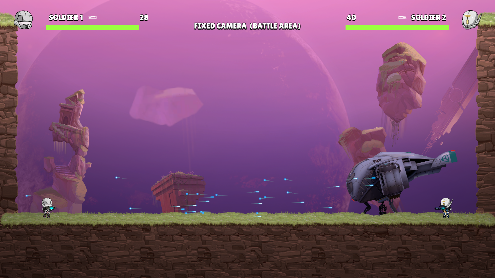
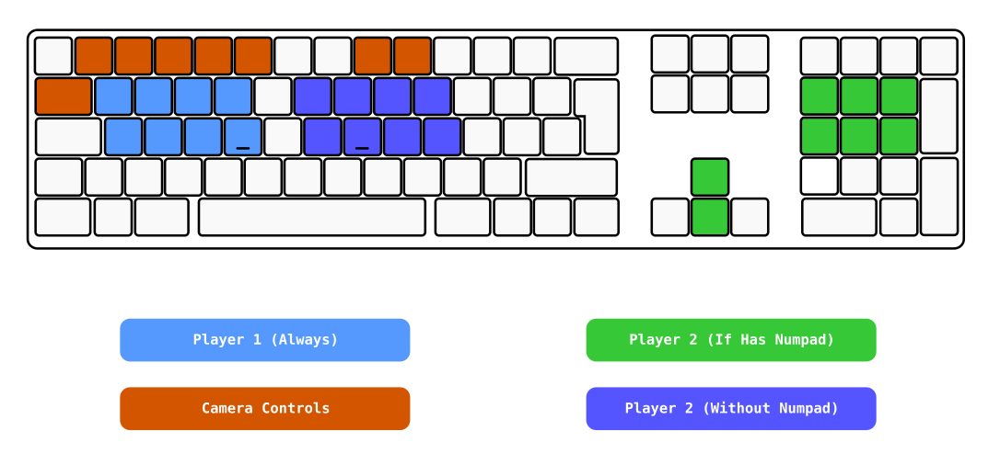
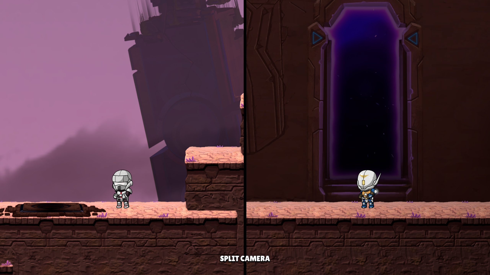
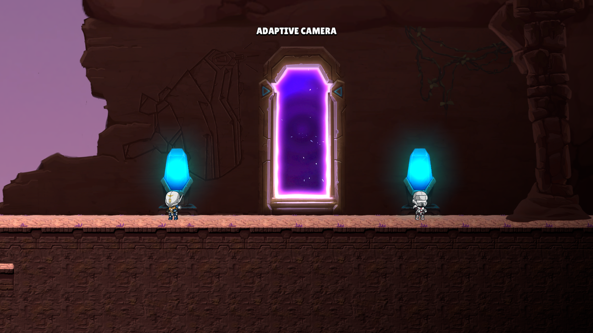

<div align="center">
  <h1>🤝🏻 Cooperative</h1>
  <p></p>
</div>

<div align="center">
  
</div>

<p></p>

In the cooperative version, players must play on the same screen. The game is designed to be played with two players, it is not possible to play alone (unless you control both characters). The goal of this version is to reach the end of the level by working together, as they will need to help each other to overcome obstacles. At the end of the level, players must confront each other in a final battle to determine the winner.

## 📖 Table of Contents

- [🛠️ How to Play](#️-how-to-play)
  - [Windows](#windows)
  - [Linux](#linux)
- [⚙️ Setup](#️-setup)
- [🎥 Cameras](#-cameras)
- [🎮 Controls](#-controls)
  - [Gamepad Controls](#gamepad-controls)
  - [Keyboard Controls](#keyboard-controls)
  - [Control Assignment](#control-assignment)
- [🤖 Players (Important for Gameplay)](#-players)
- [🤯 Known Bugs](#-known-bugs)
- [📷 Screenshots](#-screenshots)

## 🛠️ How to Play

Download the game from the [releases page](https://github.com/iivvaannxx/isolated/releases/tag/cooperative) for your operating system. Then follow the instructions below.

### Windows

1. Download the `IsolatedCooperative_Windows.zip` file.
2. Extract the contents of the zip file to your preferred location.
3. Run the `Isolated.exe` file.

### Linux
1. Download the `IsolatedCooperative_Linux.zip` file from the releases page.
2. Extract the contents of the zip file to your preferred location.
3. Run the `Isolated` executable via the following commands:
```bash
# Ensure the file is executable.
chmod +x Isolated
./Isolated
```
## ⚙️ Setup

Upon starting the game, you'll be greeted with a "configuration" scene, where you can set up which input device you want to use. The game can be played with both a keyboard and a gamepad.


Just do as it says; If you want to use the keyboard, press any key to automatically detect it. If you want to use a gamepad, press any button on the gamepad and it will also be automatically detected. When all the players have configured their input devices, a 5-second countdown will start, and then the game will begin.

## 🎥 Cameras

One of the requirements of the cooperative version was to have multiple cameras and the ability to switch between them. The different modes available are:

- **Follow Player 1**: The camera follows Player 1, and player 2 may be off-screen.
- **Follow Player 2**: The camera follows Player 2, and player 1 may be off-screen.
- **Fixed Camera**: The camera is fixed in a position, and does not move.
- **Adaptive Camera** (Default): The camera adapts to the position of both players, ensuring they are both on-screen.
- **Split Camera**: The screen is divided in half, with each player having their camera.

The controls to switch between cameras are explained in the [Controls](#-controls) section.

> [!TIP]
> When using the split camera, you can toggle between horizontal and vertical split (see controls below).

## 🎮 Controls

The game supports both gamepad and keyboard controls. Here's a breakdown of the controls for each:

### Gamepad Controls

| Action | Control |
|--------|---------|
| Move (Left / Right) | Left Stick |
| Jump | South Button (e.g., `X` on PlayStation) |
| Crouch | East Button (e.g., `O` on PlayStation) |
| Shoot | Right Trigger (e.g., `R2` on PlayStation) |
| Reload | West Button (e.g., `Square` on PlayStation) |
| Aim (Up / Down) | Right Stick |
| Switch To Previous Camera | Left Shoulder (e.g., `L1` on PlayStation) |
| Switch To Next Camera | Right Shoulder (e.g., `R1` on PlayStation) |
| Toggle Split Camera | Press Right Stick (e.g., `R3` on Playstation) |

### Keyboard Controls

| Action | Player 1 | Player 2 (with Numpad) | Player 2 (without Numpad) |
|--------|----------|------------------------|---------------------------|
| Move Left | `KeyA` | `Numpad4` | `KeyJ` |
| Move Right | `KeyD` | `Numpad6` | `KeyL` |
| Jump | `KeyW` | `Numpad8` | `KeyI` |
| Crouch | `KeyS` | `Numpad5` | `KeyK` |
| Shoot | `KeyQ` | `Numpad7` | `KeyO` |
| Reload | `KeyE` | `Numpad9` | `KeyU` |
| Aim Up | `KeyR` | `Up Arrow` | `KeyY` |
| Aim Down | `KeyF` | `Down Arrow` | `KeyH` |
| Switch To Previous Camera | `Num8` | `Num8` | `Num8` |
| Switch To Next Camera | `Num9` | `Num9` | `Num9` |
| Toggle Split Camera | `Tab` | `Tab` | `Tab` |

<details>
  <p></p>
  <summary>If this table is a bit confusing to you, look at this image, sometimes an image is worth a thousand words:</summary>

  

</details>

### Control Assignment

- If both players choose gamepads, each player uses their respective gamepad controls.
- If both players choose a keyboard, Player 1 uses the first set of keyboard controls, and Player 2 uses either the numpad or alternative set, depending on your keyboard.
- If one player chooses the gamepad and the other keyboard, the gamepad player uses gamepad controls, and the keyboard player uses Player 1's keyboard controls.

## 🤖 Players

The players have different stats that affect the gameplay. Here's a breakdown of each player:

| Player | Jump Height | Accuracy | Fire Rate | Crouch Accuracy | Magazine Capacity | Damage |
|--------|-------------|----------|-----------|-----------------|-------------------|--------|
| Player 1 | 90 | 0.9 | 900 | 1 | 50 | 8 |
| Player 2 | 100 | 0.8 | 1100 | 0.9 | 40 | 5 |

In short, in terms of battle stats, Player 1 has a slower fire rate but a bit more damage and a higher precision. Player 2 has a faster fire rate but less damage and precision. Regarding movement, Player 1 jumps a bit lower than Player 2, this is **important**, as there are some obstacles that only Player 2 can jump over.

> [!TIP]
> You can jump on top of the other player to reach higher places.


## 🤯 Known Bugs

- When activating the moving platforms, if there's a player currently standing on an activator, and the other player enters the other activator if the former gets off the activator, the platform will stop moving (even though the other player is standing on the activator at the other side). You need to make the latter player get off the activator and get back on it to make the platform move again.

- When selecting the input device, if you use the same gamepad for both players, the game will become unplayable, because you'll be controlling both players at the same time.

## 📷 Screenshots





