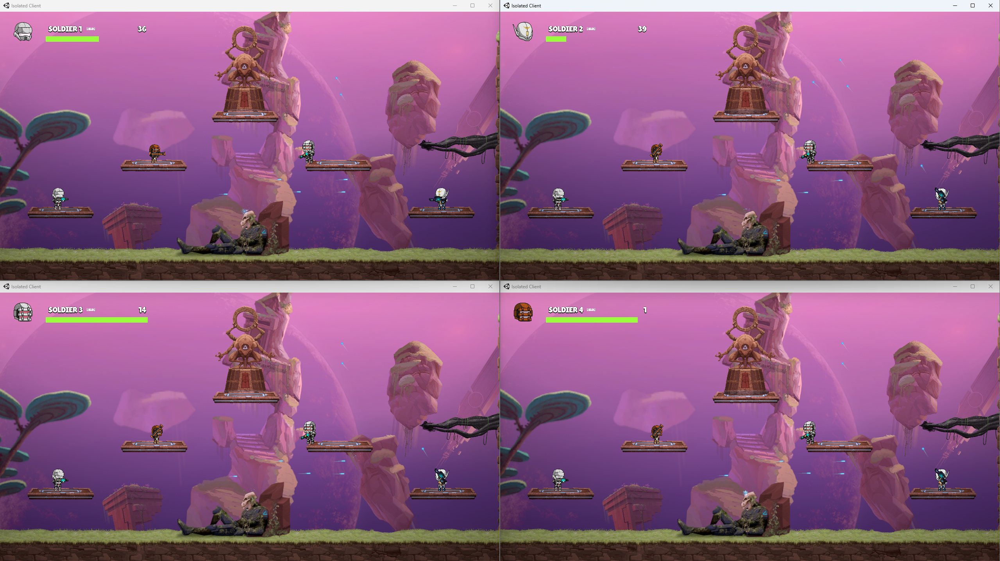
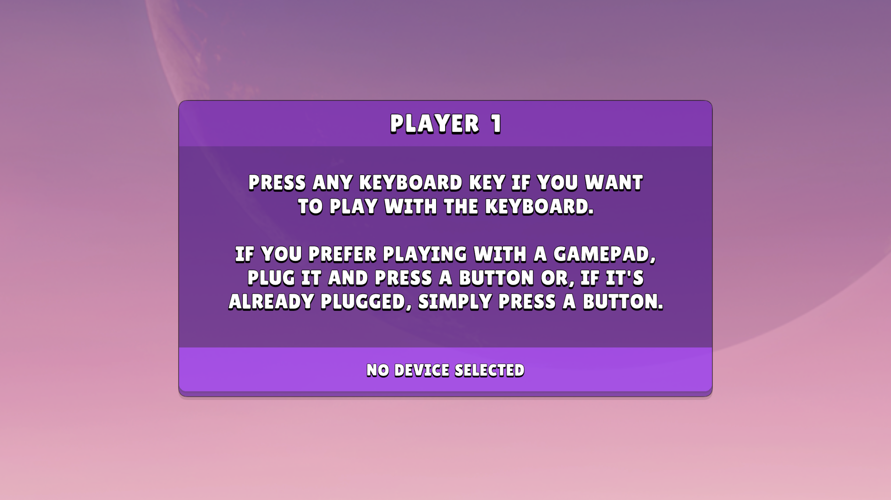
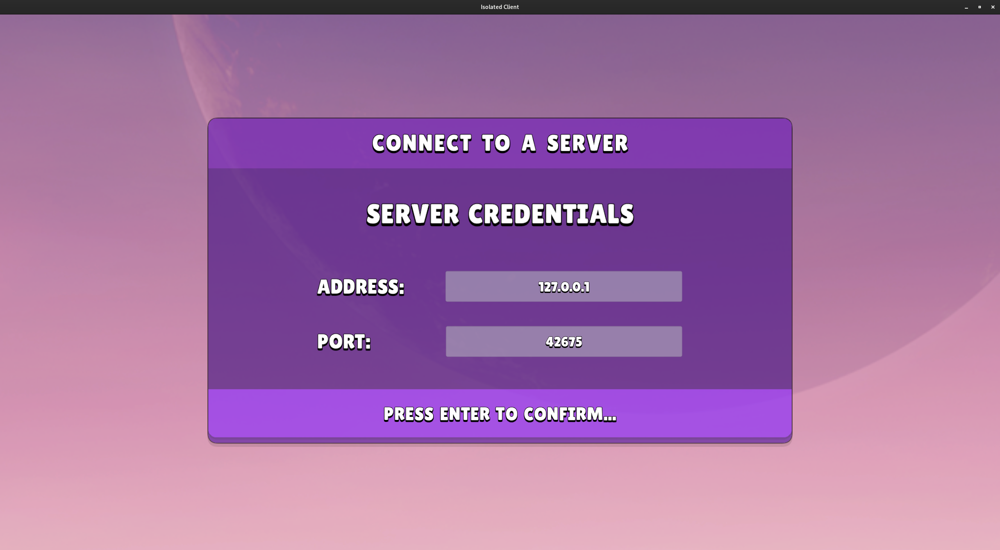
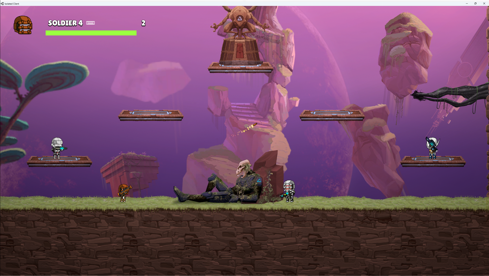
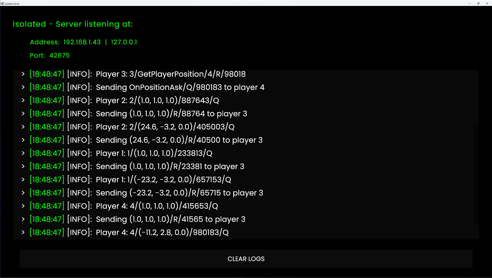

<div align="center">
  <h1>👥 Multiplayer</h1>
  <p></p>
</div>


<div align="center">
  
</div>

<p></p>
<p>
In the multiplayer version of the game, players can connect to a server and play against each other. The players don't necessarily need to use the same computer, although its possible. In this version there's no co-op, players must fight each other to determine the winner.
</p>

> [!IMPORTANT]
> The maximum number of allowed players in a single server is 4 players. If you try to connect to a server that already has 4 players inside, it won't let you in. You can start as many servers as you want, but each server can only have 4 players.

> [!NOTE]
> You can try the entire game by yourself. You only need to follow the instructions below and open as many clients as you want to connect. The game runs in "Windowed" mode by default to facilitate this.

## 📖 Table of Contents

- [🛠️ How to Play](#️-how-to-play)
  - [Windows](#windows)
  - [Linux](#linux)
- [⚙️ Setup](#️-setup)
- [🔄 Server Synchronization (⚠️ Important)](#-server-synchronization)
- [🎮 Controls](#-controls)
  - [Gamepad Controls](#gamepad-controls)
  - [Keyboard Controls](#keyboard-controls)
- [🤖 Players (Important for Gameplay)](#-players)
- [🤯 Known Bugs](#-known-bugs)
- [📷 Screenshots](#-screenshots)

## 🛠️ How to Play

Download the game from the [releases page](https://github.com/iivvaannxx/isolated/releases/tag/multiplayer) for your operating system. You'll see that inside the zip files, there are 2 different executables, one named `Client` and the other named `Server`. To play the game and for the clients to be able to connect, you need to run the server first.

The server will automatically find an available port and start listening for connections. You'll be able to see the credentials all the time, which you'll need to provide to the clients to connect.

> [!NOTE]
> While is it possible to run a server and allow client connections from a different network (someone who is not connected to the same router), this guide will only cover local connections. If you know what you're doing, setting up a server to play with someone who isn't in your network is not complicated, but it involves opening ports on the router, figuring out your public IP, and tweaking your Firewall, things which are out of the scope of this guide.

### Windows

1. Download the `IsolatedMultiplayer_Windows.zip` file.
2. Extract the contents of the zip file to your preferred location.
3. Navigate to the `Server` folder and run the `Isolated` executable inside it (this is all what's needed for the server).
4. Navigate to the `Client` folder and run the `Isolated` executable inside it.
5. Follow the instructions under the [Setup](#️-setup) section below and you'll be ready to play.


### Linux
1. Download the `IsolatedMultiplayer_Linux.zip` file from the releases page.
2. Extract the contents of the zip file to your preferred location.
3. Navigate to the `Server` folder and run the `Isolated` executable via the following commands:

```bash
# Ensure the file is executable.
chmod +x Isolated

# Run the server. The '&' is optional. 
# But it will allow to run the process in the background.
# And keep the terminal free for other commands.
./Isolated &
```
4. Navigate to the `Client` folder and run the `Isolated` executable via the following commands:

```bash
# Ensure the file is executable.
chmod +x Isolated
./Isolated
```

5. Follow the instructions under the [Setup](#️-setup) section below and you'll be ready to play.


## ⚙️ Setup

Upon starting the game, you'll be greeted with a "configuration" scene, where you can set up which input device you want to use. The game can be played with both a keyboard and a gamepad.



Just do as it says; If you want to use the keyboard, press any key to automatically detect it. If you want to use a gamepad, press any button on the gamepad and it will also be automatically detected. When all the players have configured their input devices, a 5-second countdown will start, and then the game will begin.

After that, you'll be prompted to enter the server credentials. You'll need to provide the IP address and the port of the server you want to connect to. The default values are the credentials used by the first launched server, you shouldn't need to change them if you're connecting to that server, but if they are different, just change them accordingly.



## 🔄 Server Synchronization

The client-server architecture uses an authoritative server, which means that the server is the one that has the final say on what happens in the game. The clients communicate all their actions to him, and he decides what to do with them. This is done to ensure that all the clients are in sync with each other and that there are no discrepancies between them.

There's only one "gotcha". I don't recall why we did such a thing, but I'm pretty sure it was for a good reason. The "synchronization" is not perfect, and it's not constant. It happens around every 2 seconds (slow). This means that in the time between those 2 seconds, there's a possibility that the clients will be out of sync (different state). 

The players may go out of sync depending on the connection speed and how they interact with the environment and the physics, which even if they are designed to be deterministic, they're not perfect in these cases. 

> [!NOTE]
> This is not intended to be a professional game, while we tried to make it as good as possible, we didn't have the time to make it perfect (deadlines...). Hope you enjoy it anyway!

## 🎮 Controls

The game supports both gamepad and keyboard controls. Here's a breakdown of the controls for each:

### Gamepad Controls

| Action | Control |
|--------|---------|
| Move (Left / Right) | Left Stick |
| Jump | South Button (e.g., `X` on PlayStation) |
| Crouch | East Button (e.g., `O` on PlayStation) |
| Shoot | Right Trigger (e.g., `R2` on PlayStation) |
| Reload | West Button (e.g., `Square` on PlayStation) |
| Aim (Up / Down) | Right Stick |

### Keyboard Controls

> [!IMPORTANT]
> If you come from playing the cooperative version, know that the "Shoot" action on this version is mapped to the `Space` key on the keyboard, as it's not necessary to share it with another player, and it's a bit more comfortable to use.

| Action | Player 1 | 
|--------|----------|
| Move Left | `KeyA` |
| Move Right | `KeyD` | 
| Jump | `KeyW` | 
| Crouch | `KeyS` | 
| Shoot | `Space` | 
| Reload | `KeyE` | 
| Aim Up | `KeyR` | 
| Aim Down | `KeyF` | 

## 🤖 Players

Depending on the order you connect to a server, you'll be assigned a different player. There are 4 different characters, each with different stats. Here's a breakdown of the stats for each player:

| Player | Speed | Jump Height | Accuracy | Fire Rate | Crouch Accuracy | Magazine Capacity | Damage |
|--------|-------|-------------|----------|-----------|-----------------|-------------------|--------|
| Player 1 | 10 | 125 | 0.9 | 900 | 1 | 50 | 8 |
| Player 2 | 11 | 140 | 0.8 | 1100 | 0.9 | 40 | 5 |
| Player 3 | 8 | 125 | 0.75 | 600 | 0.8 | 30 | 24 |
| Player 4 | 15 | 150 | 0.85 | 50 | 0.95 | 2 | 50 |

So, the players can be described as follows:

- **Player 1**: The most balanced character, with average stats in all categories.
- **Player 2**: A bit faster than Player 1, but with less accuracy and damage, but a higher fire rate.
- **Player 3**: The slowest character, but with a really high damage and the slowest fire rate.
- **Player 4**: This player wields a bazooka, that's why it has such high damage and a small magazine capacity. It's also the fastest character, **but it has a handicap**, it needs to be stationary to shoot; you can't shoot if you're moving, unlike the other players.

## 🤯 Known Bugs

- Read the [Server Synchronization](#-server-synchronization) section above if you experience any desync between the clients. You may consider it a bug, but it has a reason.

- The bullets that are shot by the players are not synced with new clients, this is a missing feature we didn't have time to implement. If you're a new client connecting to a server where the players are already shooting, you won't see the already-shot bullets, but you'll see the new ones.

## 📷 Screenshots





