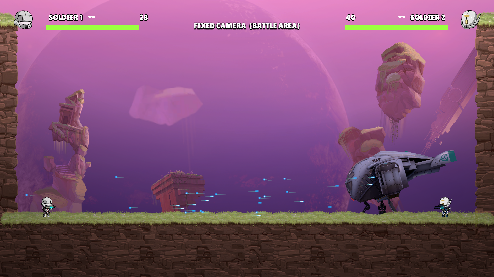
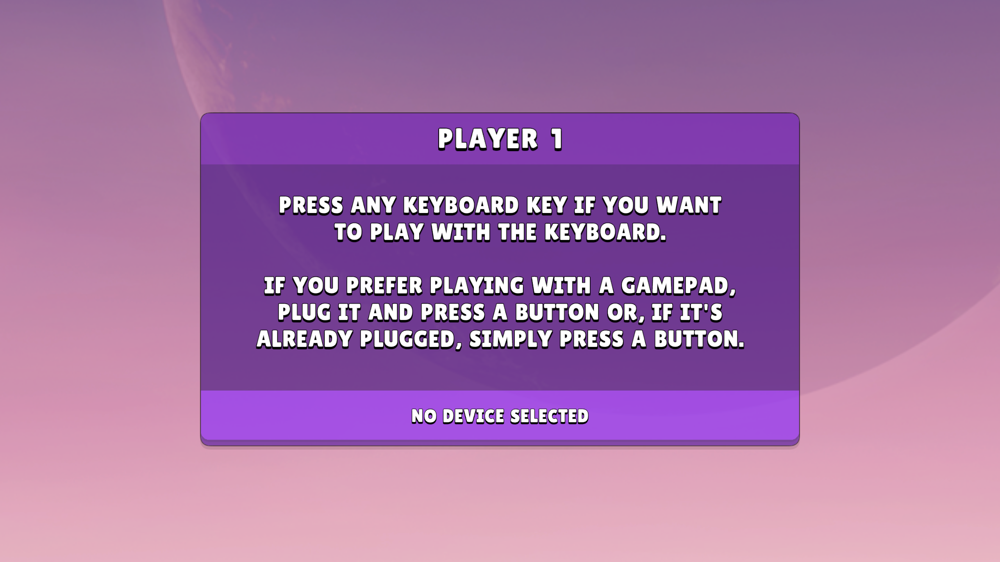
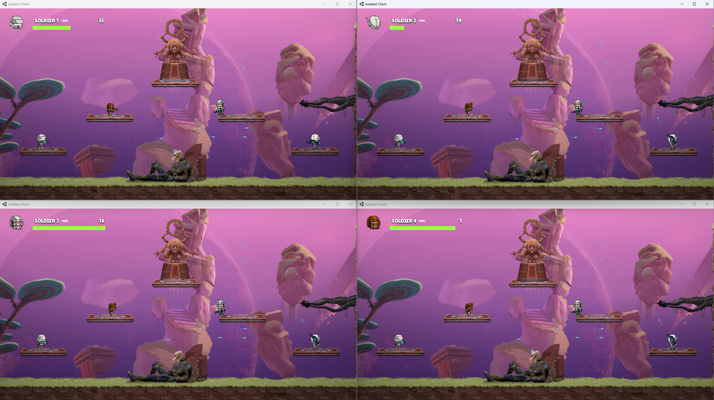

<div align="center">
  <h1>🤖 Isolated</h1>
  <p></p>
</div>

<div align="center">
  
</div>

<p></p>

<div align="center">
  📥 <a href="https://github.com/iivvaannxx/isolated/releases/tag/1.0.0">Download</a>
  <span>&nbsp;·&nbsp;</span>
  🔑 <a href="https://github.com/iivvaannxx/isolated?tab=License-1-ov-file">License</a>

  <p></p>
  <p><em><b>A 2D multiplayer platformer shooter, set in a world devastated by an alien invasion.</b></em></p>

  <p align="center">
     <a href="https://unity.com/"></a>
     <a href="https://www.linux.org"></a>
    <a href="https://www.microsoft.com/en-us/windows"></a>
  <a href="https://dotnet.microsoft.com/"></a>
  <a href="https://learn.microsoft.com/en-us/dotnet/csharp/"></a>
    
  </p>
</div>

<p></p>

> [!IMPORTANT]
> This repository is only a showcase of the game. It provides the links to download the game and information about it. The game is not open-source and the source code is not available, primarily due to the use of assets which license does not allow redistribution. The game is built using Unity and is available for Windows and Linux.

## 📖 Introduction

Isolated is a 2D cooperative/multiplayer platformer game developed as a college project. Set in a world devastated by an alien invasion, players take on the roles of soldiers who must work together to escape a dangerous environment and reach safety. 

Here's a version that stays as close as possible to your original wording while improving the grammar:
The main objective of the project was to build a multiplayer game using Unity. The development was progressive: we started with a cooperative version of the game, where players could play together on the same screen. Then we added a P2P multiplayer version, and finally we implemented a client-server multiplayer version (with an authoritative server).

This repository contains only the **cooperative** and **client-server** versions of the game, because I couldn't find the **P2P** version. The gameplay differs a bit between both versions, but if you read the instructions below you will be able to play the game without any problem.

## ⚙️ Setup

Upon starting any of the two versions of the game, you'll be greeted with a "configuration" scene, where you can set up which input device you want to use. The game can be played with both a keyboard and a gamepad.

You will be presented with a modal like this (for all players):



Just do as it says; If you want to use the keyboard, press any key and it will be automatically detected. If you want to use a gamepad, press any button on the gamepad and it will also be automatically detected. When all the players have configured their input devices, a 5-second countdown will start, and then the game will begin.

Let's see how to play each version!


## 🤝🏻 Cooperative

In the cooperative version, players must play on the same screen. The game is designed to be played with two players, it is not possible to play alone. The goal of this version is to reach the end of the level by working together, as they will need to help each other to overcome obstacles. At the end of the level, players will need to confront each other in a final battle to determine the winner.

### How to Play

Go ahead and download the game from the [releases page](https://github.com/iivvaannxx/isolated/releases/tag/1.0.0) for your operating system. Then follow the instructions below.

#### Windows

1. Download the `IsolatedCooperative_Windows.zip` file.
2. Extract the contents of the zip file on your preferred location.
3. Run the `Isolated.exe` file.

#### Linux
1. Download the `IsolatedCooperative_Linux.zip` file from the releases page.
2. Extract the contents of the zip file on your preferred location.
3. Run the `Isolated` executable via the following commands:
```bash
# Ensure the file is executable.
chmod +x Isolated
./Isolated
```

After doing this you will be presented with the setup scene I mentioned before. Configure your input device and start playing!

> [!WARNING]
> There's a known bug where the game allows you to control both players with the same gamepad. If you select a gamepad as the input device for both players and it's the same, you will be moving both players at the same time, and the game will be unplayable. To avoid this, make sure to use different gamepads for each player. If you use a keyboard for both, don't worry, the controls will be different for each player (explained below).

### Controls

The controls depend on the input device you choose and whether you are player 1 or player 2. Because you can play with either a keyboard or a gamepad, there are three possible configurations. Before explaining each one, look at this image:


As you can see, the player 2 may have different controls depending on the type of keyboard used. If the keyboard has a numpad (not all laptops have it), his controls will be the **green** ones. If it doesn't have a numpad, the controls will be the **purple** ones. The controls of the player 1 **never change**, they are always the **blue** ones. The **red** controls are used to control the different cameras.

<div align="center">

| Numpad | Player | Move (Left / Right) | Jump | Crouch | Shoot | Reload | Aim (Up / Down) |
|--------|--------|----------------------|------|--------|-------|-------|---------|
| *  | P1 | `A` / `D` Keys | `W` Key | `S` Key | `Q` Key | `E` Key | `R` / `F` Keys |
| ✅ | P2 | `4` / `6` Keys | `8` Key | `5` Key | `7` Key | `9` Key | `Up` / `Down` Keys |
| ❌ | P2 | `J` / `L` Keys | `I` Key | `K` Key | `O` Key | `U` Key | `Y` / `H` Keys |

</div>


### Walkthrough

## 👥 Multiplayer


## 🤯 Known Bugs


## 📜 License

Isolated © 2022 by Ignasi Ezpeleta & Ivan Porto Wigner is licensed under CC BY-NC-ND 4.0. To view the details of this license, visit this link.

## 📷 Screenshots





